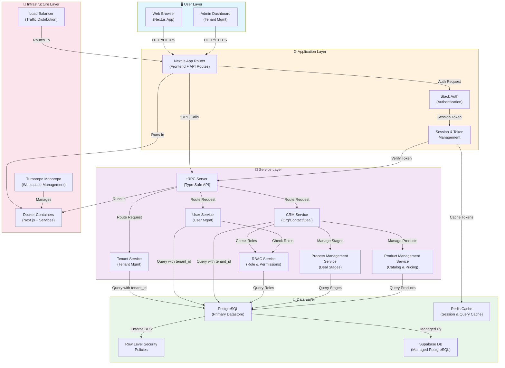

## 1. Epic Architecture Overview

The Multi-Tenant CRM Platform is designed as a modular, SaaS-ready system built on a foundation of **database-enforced tenant isolation** using PostgreSQL Row Level Security (RLS). The architecture prioritizes security, scalability, and extensibility, enabling future modules to be added without re-architecting core systems.

The technical approach uses a **domain-driven architecture** pattern with clear separation between:

- **Root Domain Layer** (`aura.com`): Company marketing, landing page, public content (home, purpose, hiring, address, etc.)
- **Tenant Subdomain Layer** (`{tenant-name}.aura.com`): Isolated tenant workspaces with database-enforced RLS
- **Core Platform Layer**: Tenant management, authentication, user membership, and RBAC
- **Module Layer**: CRM module (Phase 1) with organization, contact, and deal management
- **Infrastructure Layer**: Next.js application frontend, tRPC API layer, PostgreSQL with RLS policies, and Supabase managed services

The system enforces tenant isolation at the database level through PostgreSQL RLS policies, ensuring no application-layer bypasses can compromise data security. Each tenant receives a unique subdomain during onboarding, providing a branded and professional workspace URL while maintaining complete data isolation through database-level security policies.

---

## 2. System Architecture Diagram



---

## 3. High-Level Features & Technical Enablers

### High-Level Features

#### Core Platform Features

1. **Tenant Management**

   - Create and manage multiple tenant organizations
   - Tenant-level configuration and metadata
   - Tenant activation/deactivation
   - Tenant lifecycle tracking (prospect → pending → active → suspended → deleted)
   - Contract signing workflow integration

2. **User Authentication & Authorization**

   - Secure user authentication via Stack Auth
   - Pre-tenant account support (user signup before tenant creation)
   - Tenant membership assignment
   - Session and token management

3. **Role-Based Access Control (RBAC)**

   - Define roles within each tenant (Admin, Manager, Sales Rep)
   - Assign permissions to roles
   - Enforce role-based permissions at API and UI levels
   - Support for future custom role customization

4. **Tenant-Level Data Isolation**
   - Database-enforced tenant isolation via RLS
   - Tenant-aware queries across all entities
   - Audit logs for data access and sensitive operations

#### CRM Module Features

5. **Organization (Company) Management**

   - Create, read, update, delete organizations
   - Organization metadata (name, industry, size, location)
   - Tenant-scoped organization storage

6. **Contact Management**

   - Create, read, update, delete contacts
   - Contact details (name, email, phone, role)
   - Link contacts to organizations
   - Contact search functionality
   - Tenant-scoped contact storage
   - Activity tracking (calls, emails, meetings, notes)

7. **Deal/Opportunity Management**

   - Create, read, update, delete deals
   - Deal lifecycle (from creation through closure)
   - Deal values, probabilities, and close dates
   - Link deals to organizations and contacts
   - Tenant-scoped deal storage
   - Deal audit trail (stage changes, price adjustments, product additions)

8. **User Assignment & Ownership**
   - Assign users to CRM entities (organizations, deals, contacts)
   - Track record ownership
   - Support for collaborative access based on roles
   - Audit logging for reassignments

#### Process Management Features

9. **Deal Pipeline/Stage Management**

   - Default deal pipeline (Prospect → Qualified → Proposal → Negotiation → Won/Lost)
   - Per-tenant customizable deal stages
   - Stage reordering and configuration
   - Stage metadata support (required fields, win probability defaults)
   - Deal stage change tracking with timestamps and user attribution
   - Deal stage immutability for historical records

#### Product Management Features

10. **Product Catalog & Pricing Blueprint**

- Create and manage product catalog (SKU, name, description, category)
- Define pricing templates (blueprints) per product
- Pricing blueprint attributes (default price, cost, discount policy, margin targets)
- Activate/deactivate products
- Pricing history tracking
- Custom fields support per product

11. **Deal Products & Pricing**

- Add products (line items) to deals
- Inherit product pricing blueprints on deal line items
- Manual price override capability per line item
- Automatic deal total calculation
- Price adjustment tracking in deal audit trail
- Line item management (add, edit, remove)

### Technical Enablers

1. **Database Layer**

   - PostgreSQL with Row Level Security (RLS) policies
   - Tenant isolation at the database level
   - Proper indexing on `tenant_id`, `assigned_to`, `stage`, `created_at`, `product_id`
   - Audit tables for compliance (user creation, role changes, data deletions, RLS violations, stage changes, pricing changes)
   - Deal stage configuration storage (per-tenant, immutable for closed deals)
   - Product and pricing blueprint tables

2. **Authentication & Authorization**

   - Stack Auth integration for secure authentication
   - Session management and token handling with tenant context
   - JWT-based authorization tokens with tenant identifier
   - Pre-tenant account support (contract status field)
   - Tenant activation workflow triggers

3. **API Layer**

   - tRPC for type-safe, end-to-end typed APIs
   - Middleware for tenant context extraction and validation
   - Error handling and validation
   - Rate limiting (100 requests per minute per user)

4. **Application Framework**

   - Next.js with App Router for frontend and API routes
   - Server components for rendering efficiency
   - API routes for tRPC and webhooks
   - Support for real-time deal calculations (<500ms latency)

5. **Service Layer Expansion**

   - **Process Management Service**: Handle deal stage configuration, stage transitions, stage validation
   - **Product Management Service**: Handle product catalog, pricing blueprints, pricing history
   - **Deal Calculation Service**: Real-time calculation of deal totals from line items
   - Enhanced **CRM Service**: Support for deal line items, activity tracking, user assignment validation

6. **Monorepo Structure**

   - Turborepo for workspace management
   - Shared utilities and types across modules
   - Clear separation of concerns (core vs. modules vs. process/product management)

7. **Deployment & Infrastructure**

   - Docker containerization for services
   - Supabase managed PostgreSQL
   - Environment configuration management
   - Support for automated tenant provisioning

8. **Caching & Performance**
   - Redis for session caching
   - Query result caching for frequently accessed data (product catalog, deal stages)
   - RLS policy optimization
   - Deal calculation result caching where appropriate

---

## 4. Technology Stack

| Category               | Technology               | Rationale                                                                |
| ---------------------- | ------------------------ | ------------------------------------------------------------------------ |
| **Frontend**           | Next.js (App Router)     | Type-safe, server-side rendering, API routes, modern React patterns      |
| **Backend API**        | tRPC                     | End-to-end type safety, seamless TypeScript integration with frontend    |
| **Authentication**     | Stack Auth               | Secure, managed authentication service with session handling             |
| **Database**           | PostgreSQL + Supabase    | Enterprise-grade relational DB, RLS support, managed service             |
| **Row Level Security** | PostgreSQL RLS           | Database-enforced tenant isolation, no application-layer bypasses        |
| **Language**           | TypeScript               | Type safety across full stack, reduces bugs and improves maintainability |
| **Monorepo**           | Turborepo                | Efficient workspace management, shared types and utilities               |
| **Caching**            | Redis                    | Session management, query caching, performance optimization              |
| **Containerization**   | Docker                   | Consistent deployment across environments, scalability                   |
| **ORM/Query Builder**  | Prisma or PostGIS Client | Type-safe DB queries, RLS-aware query construction                       |

---

## 5. Technical Value

**Technical Value: High**

### Justification

1. **Security Foundation**: Database-enforced tenant isolation via RLS eliminates cross-tenant data leakage risks at the architecture level, not just the application level.

2. **Scalability**: The modular, domain-driven design allows future modules (HCM, testing systems, internal tools) to be added without re-architecting core systems or the tenant isolation mechanism.

3. **Developer Velocity**: End-to-end type safety with TypeScript and tRPC reduces runtime errors and improves code quality. Monorepo structure enables code sharing and faster development.

4. **Maintainability**: Clear separation between core platform (tenant, user, auth) and business modules (CRM) makes the codebase easier to understand, test, and extend.

5. **Compliance Ready**: Audit logs, RLS policies, and tenant isolation support GDPR, SOC2, and other regulatory requirements.

6. **Future-Proof**: The modular architecture reduces technical debt and enables the platform to evolve without major refactors.

---

## 6. T-Shirt Size Estimate

**Estimate: L (Large)**

### Sizing Rationale

- **Complexity**: Multi-tenant architecture with RLS policies requires careful design and testing. Database schema design, RLS policy setup, and tenant isolation verification are non-trivial.
- **Scope**: Includes core platform layer (tenant, user, auth, RBAC) + CRM module (organizations, contacts, deals) = multiple interconnected domains.
- **Deployment Infrastructure**: Docker containerization, Supabase setup, Redis caching, and multi-environment configuration add overhead.
- **Testing & Validation**: Extensive testing required to verify tenant isolation, RBAC, and data security.
- **Documentation & Training**: Architecture, API contracts, and deployment procedures must be thoroughly documented for future module development.

**Estimated Duration**: 10–14 weeks for a team of 3–4 developers (design, implementation, testing, deployment).

---

## 7. Core Domain Model

### Entity Relationship Overview

```
Tenant
├── Users (via TenantMember)
├── Roles (per-tenant RBAC)
└── CRM Data
    ├── Organizations
    ├── Contacts
    └── Deals

User
├── TenantMemberships (many-to-many with Tenant)
└── Roles (per tenant)

Organization (CRM)
├── Contacts
└── Deals

Contact (CRM)
├── Organization
└── Deals (many-to-many)

Deal (CRM)
├── Organization
├── Contacts (many-to-many)
└── Assigned User(s)
```

### Database Schema Principles

- **All entities include `tenant_id`** as a foreign key and part of RLS policies
- **All queries are tenant-aware** and include `WHERE tenant_id = current_user_tenant_id()`
- **RLS Policies enforce**: Users can only see/modify data within their tenant
- **Indexes on `tenant_id`** for query performance

---

## 8. Deployment Architecture

### Environment Structure

```
Development Environment
├── Docker containers (local or dev server)
├── Supabase development DB
└── Mock/staging data

Staging Environment
├── Docker containers (staging server)
├── Supabase staging DB
└── Production-like configuration

Production Environment
├── Docker containers (load-balanced, replicated)
├── Supabase production DB (replicated, backed-up)
└── Redis cluster (for caching and sessions)
```

---

## 9. Security Architecture

### Tenant Isolation Strategy

1. **Database Level (Primary)**

   - PostgreSQL RLS policies enforce tenant isolation
   - Policies check `auth.uid()` and map to `tenant_id`
   - All queries filtered by `tenant_id` at the DB level

2. **Application Level (Defense-in-Depth)**

   - Extract tenant context from authentication token
   - Pass tenant context through tRPC middleware
   - All tRPC resolvers validate tenant ownership before returning data

3. **Authentication Level**
   - Stack Auth manages user authentication and session tokens
   - Tokens include tenant identifier for context
   - Secure token refresh and expiration policies

### Data Protection

- **Encryption in Transit**: HTTPS/TLS for all communications
- **Encryption at Rest**: Database encryption via Supabase
- **Audit Logging**: All data access and modifications logged for compliance

---

## 10. Success Criteria

- ✅ Zero cross-tenant data access incidents
- ✅ RLS policies tested and validated for all entities
- ✅ CRM module fully functional for SMB sales teams
- ✅ New tenants onboard without manual intervention
- ✅ Platform architecture supports future module additions without refactor
- ✅ API response times < 200ms for 95th percentile under normal load
- ✅ Comprehensive documentation for developers and operations teams

---

## 11. Future Extensibility

This architecture supports adding new modules by:

1. **Adding new tables** with `tenant_id` column
2. **Creating RLS policies** for tenant isolation
3. **Implementing domain services** in the service layer
4. **Extending tRPC router** with new module routes
5. **No changes to core platform** or existing RLS policies required

**Planned Modules** (High-Level Roadmap):

- Phase 2: CRM enhancements (advanced reporting, workflows)
- Phase 3: HCM (Human Capital Management)
- Phase 4: Testing/QA system
- Phase 5: Marketplace and integrations

---

## 12. Risk Mitigation

| Risk                            | Mitigation                                                                                   |
| ------------------------------- | -------------------------------------------------------------------------------------------- |
| **RLS Policy Misconfiguration** | Thorough policy testing, code review, staging environment validation                         |
| **Performance Degradation**     | Index `tenant_id`, cache frequently accessed data, profile queries                           |
| **Cross-Tenant Data Leakage**   | Database-level enforcement, audit logging, regular security audits                           |
| **Tenant Scaling Issues**       | Monitor query performance, plan for data archiving, consider sharding for very large tenants |
| **Developer Error**             | Middleware enforcement, TypeScript validation, comprehensive testing framework               |

---

**End of Architecture Specification**
