## 1. Epic Architecture Overview

The Multi-Tenant CRM Platform is designed as a modular, SaaS-ready system built on a foundation of **database-enforced tenant isolation** using PostgreSQL Row Level Security (RLS). The architecture prioritizes security, scalability, and extensibility, enabling future modules to be added without re-architecting core systems.

The technical approach uses a **domain-driven architecture** pattern with clear separation between:

- **Root Domain Layer** (`aura.com`): Company marketing, landing page, public content, prospect signup, legal/compliance pages
- **Tenant Subdomain Layer** (`{tenant-name}.aura.com`): Isolated tenant workspaces with database-enforced RLS, accessible only to authenticated tenant members
- **Core Platform Layer**: Tenant management, authentication (Stack Auth), user membership, RBAC, contract lifecycle, and tenant activation workflow
- **Module Layer**: CRM module (Phase 1) with organization, contact, deal management, activity tracking, and deal composition
- **Process Management Layer**: Multi-process sales pipeline support with process configuration, stage customization, and stage lifecycle management per tenant
- **Product Management Layer**: Product catalog, pricing blueprints, pricing history, and deal line item management
- **Infrastructure Layer**: Next.js application frontend, tRPC API layer, PostgreSQL with RLS policies, Supabase managed services, and Redis caching

The system enforces tenant isolation at the database level through PostgreSQL RLS policies, ensuring no application-layer bypasses can compromise data security. Each tenant receives a unique subdomain during onboarding (e.g., `acme.aura.com`), providing a branded and professional workspace URL while maintaining complete data isolation through database-level security policies. The contract signing workflow decouples user signup from tenant creation—users sign up first (pre-tenant state), and tenants are provisioned only upon contract signing and system admin approval.

**Key architectural enhancement:** The system supports multiple customizable sales processes per tenant. Each deal is associated with exactly one sales process at creation time. Sales processes contain ordered sequences of stages, enabling teams to use different pipelines for different deal types (e.g., enterprise vs. SMB vs. partner channel).

---

## 2. System Architecture Diagram

```mermaid
graph TB
    subgraph RootDomain["🌍 Root Domain (aura.com)"]
        MarketingWeb["Marketing Website<br/>(Next.js Static)"]
        SignupPage["Signup Page<br/>(Pre-tenant Account)"]
        LandingPage["Landing Page<br/>(Public Content)"]
    end

    subgraph UserLayer["🖥️ User Layer (Tenant Subdomains)"]
        WebBrowser["Web Browser<br/>(Next.js App)<br/>tenant.aura.com"]
        AdminDashboard["Admin Dashboard<br/>(Tenant Mgmt)"]
    end

    subgraph AppLayer["⚙️ Application Layer"]
        NextApp["Next.js App Router<br/>(Frontend + API Routes)"]
        StackAuth["Stack Auth<br/>(Authentication)"]
        SessionMgmt["Session & Token<br/>Management"]
        SubdomainRouter["Subdomain Router<br/>(Route to root or tenant)"]
    end

    subgraph ServiceLayer["🔗 Service Layer"]
        tRPCServer["tRPC Server<br/>(Type-Safe API)"]
        TenantService["Tenant Service<br/>(Lifecycle, Activation)"]
        ContractMgmt["Contract Status<br/>Management"]
        UserService["User Service<br/>(User Mgmt)"]
        CRMService["CRM Service<br/>(Org/Contact/Deal)"]
        ActivityService["Activity Service<br/>(Calls, Emails, Notes)"]
        RBACService["RBAC Service<br/>(Role & Permissions)"]
        ProcessMgmtService["Process Management Service<br/>(Sales Processes, Stages)"]
        ProductMgmtService["Product Management Service<br/>(Catalog, Blueprints)"]
        DealCalcService["Deal Calculation Service<br/>(Pricing, Line Items)"]
    end

    subgraph DataLayer["💾 Data Layer"]
        PostgreSQL["PostgreSQL<br/>(Primary Datastore)"]
        RLSPolicies["Row Level Security<br/>Policies"]
        SupabaseDB["Supabase DB<br/>(Managed PostgreSQL)"]
        Cache["Redis Cache<br/>(Session & Query Cache)"]
    end

    subgraph InfraLayer["🐳 Infrastructure Layer"]
        Docker["Docker Containers<br/>(Next.js + Services)"]
        Turborepo["Turborepo Monorepo<br/>(Workspace Management)"]
        LoadBalancer["Load Balancer<br/>(Traffic Distribution)"]
        SubdomainDNS["DNS/Subdomain<br/>Allocation"]
    end

    %% Root Domain Routing
    RootDomain -->|HTTP/HTTPS| SubdomainRouter
    UserLayer -->|HTTP/HTTPS| SubdomainRouter
    SubdomainRouter -->|Route to root| MarketingWeb
    SubdomainRouter -->|Route to tenant| NextApp

    %% Authentication Flow
    MarketingWeb -->|Signup Request| StackAuth
    SignupPage -->|Create Pre-Tenant Account| StackAuth
    StackAuth -->|Session Token| SessionMgmt
    NextApp -->|Auth Request| StackAuth

    %% App Layer -> Service Layer
    NextApp -->|tRPC Calls| tRPCServer
    SessionMgmt -->|Verify Token| tRPCServer

    %% Service Layer Orchestration
    tRPCServer -->|Route Request| TenantService
    tRPCServer -->|Route Request| UserService
    tRPCServer -->|Route Request| CRMService
    TenantService -->|Check Status| ContractMgmt
    CRMService -->|Log Interactions| ActivityService
    CRMService -->|Check Roles| RBACService
    UserService -->|Check Roles| RBACService
    CRMService -->|Manage Processes| ProcessMgmtService
    CRMService -->|Validate Process| ProcessMgmtService
    CRMService -->|Manage Products| ProductMgmtService
    CRMService -->|Calculate Deal Total| DealCalcService
    ProcessMgmtService -->|Validate Stages| ProcessMgmtService
    ProductMgmtService -->|Get Pricing| DealCalcService
    DealCalcService -->|Calculate Line Items| DealCalcService

    %% Service Layer -> Data Layer
    TenantService -->|Query with tenant_id| PostgreSQL
    ContractMgmt -->|Update Status| PostgreSQL
    UserService -->|Query with tenant_id| PostgreSQL
    CRMService -->|Query with tenant_id| PostgreSQL
    ActivityService -->|Log Activity| PostgreSQL
    RBACService -->|Query Roles| PostgreSQL
    ProcessMgmtService -->|Query/Update Processes| PostgreSQL
    ProductMgmtService -->|Query/Update Products| PostgreSQL
    DealCalcService -->|Calculate from Data| PostgreSQL
    PostgreSQL -->|Enforce RLS| RLSPolicies
    PostgreSQL -->|Managed By| SupabaseDB
    SessionMgmt -->|Cache Tokens| Cache
    ProcessMgmtService -->|Cache Processes| Cache
    ProductMgmtService -->|Cache Products| Cache

    %% Infrastructure
    NextApp -->|Runs In| Docker
    tRPCServer -->|Runs In| Docker
    Turborepo -->|Manages| Docker
    LoadBalancer -->|Routes To| NextApp
    SubdomainRouter -->|Maps to| SubdomainDNS
    SubdomainDNS -->|Allocates on Activation| TenantService

    style RootDomain fill:#c8e6c9
    style UserLayer fill:#e1f5ff
    style AppLayer fill:#fff3e0
    style ServiceLayer fill:#f3e5f5
    style DataLayer fill:#e8f5e9
    style InfraLayer fill:#fce4ec
```



---

## 3. High-Level Features & Technical Enablers

### High-Level Features

#### Core Platform Features

1. **Tenant Management & Lifecycle**

   - Create and manage multiple tenant organizations
   - Tenant-level configuration and metadata (company name, logo, industry, timezone)
   - Tenant activation/deactivation and suspension
   - Tenant lifecycle tracking (prospect → pending → active → suspended → deleted)
   - Contract signing workflow integration with system admin approval
   - Unique subdomain allocation per tenant during activation (e.g., `acme.aura.com`)

2. **User Authentication & Authorization**

   - Secure user authentication via Stack Auth (email/password)
   - Pre-tenant account support (user signup before tenant creation)
   - Contract status field tracking (prospect → contract signed → pending activation → activated)
   - Tenant membership assignment upon tenant activation
   - Session and token management with tenant context
   - JWT tokens include tenant identifier for context propagation

3. **Role-Based Access Control (RBAC)**

   - Three baseline roles: Admin, Manager, Sales Rep (per-tenant)
   - Admin: Full access to user management, settings, CRM, process/product management
   - Manager: Team management, view all team deals, basic reporting, full CRM access, read-only process/product access
   - Sales Rep: Own deals, assigned contacts/deals, add products to deals with pricing overrides
   - Assign permissions to roles at API and UI levels
   - Support for future custom role customization

4. **Tenant-Level Data Isolation**

   - Database-enforced tenant isolation via RLS policies
   - All queries filtered by `tenant_id` at the database level
   - Tenant-aware queries across all entities
   - Audit logs for data access and sensitive operations
   - RLS violations logged for security monitoring

5. **Contract & Tenant Activation Workflow**
   - System tracks contract signing status for prospects
   - System admin approves contract signing to trigger tenant provisioning
   - Automatic isolated tenant creation upon approval
   - Automatic subdomain allocation from DNS pool
   - Signup user automatically promoted to tenant admin on activation
   - Initial product catalog and default sales process seeding on activation

#### CRM Module Features

6. **Organization (Company) Management**

   - Create, read, update, delete organizations
   - Organization metadata (name, industry, size, location, website)
   - Relationship tracking (parent company, subsidiaries)
   - Custom fields support (extensible schema)
   - Tenant-scoped organization storage with RLS enforcement

7. **Contact Management**

   - Create, read, update, delete contacts
   - Contact details (name, email, phone, title, organization association)
   - Link contacts to organizations
   - Contact search functionality (by name, email, phone, company)
   - Duplicate prevention via email uniqueness constraint per tenant
   - Custom fields support (LinkedIn profile, social handles)
   - Tenant-scoped contact storage with RLS enforcement
   - User assignment tracking (assigned_to field)

8. **Deal/Opportunity Management**

   - Create, read, update, delete deals
   - Deal lifecycle (from creation through closure)
   - Deal composition: amount, probability, close date, sales process, stage, associated contact/organization
   - Deal filtering (by sales process, stage, owner, probability, organization, date range)
   - User assignment and reassignment (managers and admins only)
   - Deal-to-process binding at creation time (immutable relationship)
   - Deal audit trail (stage changes, price adjustments, product additions/removals)
   - Deal stage immutability for historical records
   - Tenant-scoped deal storage with RLS enforcement

9. **Activity Tracking**

   - Activity log entries (call, email, meeting, note) linked to contacts
   - Activity capture: type, description, date/time, participant (user), contact
   - Activity history viewing for any contact
   - Immutable activity records (no edit, only soft-delete or archive)
   - Activity audit trail with user attribution

10. **User Assignment & Ownership**
    - Contacts, deals, and organizations have assigned_to field (user_id)
    - Sales reps see records assigned to them
    - Managers and admins see all tenant records regardless of assignment
    - Reassignment auditing and logging
    - Role-based visibility enforcement

#### Process Management Features

11. **Multi-Process Sales Pipeline Management**

    - Support for multiple sales processes per tenant (e.g., "Enterprise Sales", "SMB Sales", "Partner Channel")
    - Each sales process contains an ordered sequence of deal stages
    - Default sales process: Prospect → Qualified → Proposal → Negotiation → Won/Lost
    - Per-tenant customizable sales processes (create, update, delete, reorder)
    - Per-process customizable deal stages (add, remove, rename, reorder within process)
    - Stage metadata support (required fields, win probability defaults)
    - Deal binding to single sales process at creation time
    - Process-level stage change tracking with timestamps and user attribution
    - Stage immutability for historical deals (stage names locked on closure)
    - Prevention of stage deletion with active deals without confirmation
    - Drag-and-drop and UI controls for deal stage movement within process
    - Default process designation for new deals
    - Process filtering and organization in dashboards

#### Product Management Features

12. **Product Catalog & Pricing Blueprint**

    - Product catalog management (SKU, name, description, category)
    - Pricing templates (blueprints) per product
    - Blueprint attributes: default price, cost, discount policy, margin targets
    - Activate/deactivate products for availability control
    - Pricing history tracking for compliance
    - Custom fields per product (size, color, variant)
    - Tenant-scoped product storage with RLS enforcement

13. **Deal Products & Pricing**

    - Add products (line items) to deals during creation and updates
    - Inherit product pricing blueprints on deal line items
    - Display: product name, SKU, quantity, unit price (from blueprint), extended price
    - Manual price override per line item (with audit trail)
    - Automatic deal total calculation (sum of all line items: quantity × adjusted unit price)
    - Price adjustment tracking in deal audit trail
    - Add, edit, remove line items from deals
    - Soft-delete removed line items (retained in audit history)
    - Quantity field validation (minimum 1)
    - Deal total validation (must match sum of line items)

### Technical Enablers

1. **Database Layer**

   - PostgreSQL with Row Level Security (RLS) policies
   - Tenant isolation at the database level via RLS
   - Contract status field on users table (prospect → contract_signed → pending → activated)
   - Tenant subdomain field for unique workspace URL allocation
   - Sales Process table (tenant-scoped, immutable once in use)
   - Deal Stages table (per-process, tenant-scoped)
   - Deal-to-Process foreign key relationship (1-to-1 at creation)
   - Proper indexing on `tenant_id`, `process_id`, `assigned_to`, `stage`, `created_at`, `product_id`, `contract_status`
   - Audit tables for compliance:
     - User creation/deactivation events
     - Role assignment changes
     - Data deletion events
     - RLS policy violations
     - Deal stage transitions with timestamps and user attribution
     - Process creation and modifications
     - Pricing changes with before/after values
     - Deal line item additions/removals
   - Product and pricing blueprint tables
   - Deal line items table with quantity and unit price override
   - Activity log table with immutable records

2. **Authentication & Authorization**

   - Stack Auth integration for secure authentication
   - Pre-tenant account workflow: signup without tenant assignment
   - Contract status tracking in user records
   - Session management with tenant context propagation
   - JWT-based authorization tokens with tenant identifier
   - Tenant activation workflow triggers automatic token updates
   - Secure invite link generation (valid for 7 days)
   - Email verification for password resets and sensitive operations

3. **API Layer**

   - tRPC for type-safe, end-to-end typed APIs
   - Middleware for tenant context extraction and validation
   - Contract status validation middleware (prevent pre-tenant users from accessing tenant data)
   - Process context validation middleware (ensure deal belongs to correct process)
   - Error handling and validation with structured error responses
   - Rate limiting (100 requests per minute per user)
   - Endpoint documentation via OpenAPI/Swagger

4. **Application Framework**

   - Next.js with App Router for frontend and API routes
   - Server components for rendering efficiency
   - API routes for tRPC and webhooks
   - Subdomain routing for root domain vs. tenant domains
   - Support for real-time deal calculations (<500ms latency)
   - Session management with tenant context
   - Process context propagation through component hierarchy

5. **Service Layer Expansion**

   - **Tenant Service**: Manage tenant lifecycle, contract status, activation workflow, subdomain allocation, default process seeding
   - **Contract Management Service**: Track contract signing, trigger provisioning, approve activations
   - **Activity Service**: Log and retrieve activity records for contacts, immutability enforcement
   - **Process Management Service**: Handle sales process creation/updates, stage configuration, stage transitions, stage validation per process, reordering, default process management
   - **Product Management Service**: Handle product catalog, pricing blueprints, pricing history, product activation/deactivation
   - **Deal Calculation Service**: Real-time calculation of deal totals from line items, pricing blueprint inheritance, price override tracking
   - Enhanced **CRM Service**: Support for deal line items, activity tracking, user assignment validation, deal filtering by process and composition, process binding validation

6. **Monorepo Structure**

   - Turborepo for workspace management
   - Shared utilities and types across modules
   - Clear separation of concerns (core vs. modules vs. process/product management)
   - Separate packages for domain logic and API contracts

7. **Deployment & Infrastructure**

   - Docker containerization for services
   - Supabase managed PostgreSQL
   - Environment configuration management
   - Support for automated tenant provisioning with process seeding
   - DNS/subdomain management for tenant allocation
   - Multi-environment support (dev, staging, production)

8. **Caching & Performance**
   - Redis for session caching and token validation
   - Query result caching for frequently accessed data (product catalog, sales processes, deal stages)
   - Sales process configuration caching per tenant
   - Product pricing blueprint caching
   - RLS policy optimization for large tenant datasets
   - Deal calculation result caching where appropriate
   - Cache invalidation on pricing, stage configuration, or process changes

---

## 4. Technology Stack

| Category               | Technology               | Rationale                                                                                |
| ---------------------- | ------------------------ | ---------------------------------------------------------------------------------------- |
| **Frontend**           | Next.js (App Router)     | Type-safe, server-side rendering, API routes, modern React patterns, subdomain routing   |
| **Backend API**        | tRPC                     | End-to-end type safety, seamless TypeScript integration with frontend                    |
| **Authentication**     | Stack Auth               | Secure, managed authentication service with session handling, pre-tenant account support |
| **Database**           | PostgreSQL + Supabase    | Enterprise-grade relational DB, RLS support, managed service                             |
| **Row Level Security** | PostgreSQL RLS           | Database-enforced tenant isolation, no application-layer bypasses                        |
| **Language**           | TypeScript               | Type safety across full stack, reduces bugs and improves maintainability                 |
| **Monorepo**           | Turborepo                | Efficient workspace management, shared types and utilities                               |
| **Caching**            | Redis                    | Session management, query caching, performance optimization                              |
| **Containerization**   | Docker                   | Consistent deployment across environments, scalability                                   |
| **ORM/Query Builder**  | Prisma or PostGIS Client | Type-safe DB queries, RLS-aware query construction                                       |
| **DNS/Subdomain**      | Route53 / Cloudflare     | Managed subdomain allocation, wildcard DNS for tenant subdomains                         |

---

## 5. Database Schema Highlights

### Key Entities (RLS-Protected)

- **Tenants**: `id`, `name`, `subdomain` (unique), `status` (prospect → pending → active → suspended → deleted), `default_process_id` (FK to SalesProcess), `metadata` (logo, industry, timezone)
- **Users**: `id`, `email`, `contract_status` (prospect → contract_signed → pending → activated), `created_at`
- **TenantMembers**: `user_id`, `tenant_id`, `role` (Admin, Manager, SalesRep) - junction table
- **Organizations**: `tenant_id`, `id`, `name`, `industry`, `size`, `location`, `website`, `created_by`, `updated_by`, `created_at`, `updated_at`
- **Contacts**: `tenant_id`, `id`, `name`, `email` (unique per tenant), `phone`, `title`, `organization_id`, `assigned_to`, `created_by`, `updated_by`, `created_at`, `updated_at`
- **SalesProcesses**: `tenant_id`, `id`, `name`, `is_default`, `description`, `created_by`, `updated_by`, `created_at`, `updated_at`
- **ProcessStages**: `process_id` (FK to SalesProcesses), `tenant_id`, `id`, `name`, `sequence`, `metadata` (required_fields, win_probability), `created_by`, `updated_by`, `created_at`
- **Deals**: `tenant_id`, `id`, `name`, `amount`, `probability`, `close_date`, `process_id` (FK to SalesProcesses, immutable), `stage`, `organization_id`, `assigned_to`, `created_by`, `updated_by`, `created_at`, `updated_at`
- **Products**: `tenant_id`, `id`, `sku`, `name`, `description`, `category`, `is_active`, `created_by`, `updated_by`, `created_at`, `updated_at`
- **PricingBlueprints**: `product_id`, `default_price`, `cost`, `discount_policy`, `margin_targets`, `created_by`, `updated_by`, `created_at`, `updated_at`
- **DealLineItems**: `deal_id`, `product_id`, `quantity`, `unit_price` (override), `created_by`, `updated_by`, `created_at`, `updated_at`
- **Activities**: `tenant_id`, `id`, `contact_id`, `type` (call, email, meeting, note), `description`, `date`, `participant_id`, `created_at` (immutable)
- **AuditLogs**: `tenant_id`, `id`, `event_type`, `entity_type`, `entity_id`, `user_id`, `changes`, `created_at` (immutable, retained 12 months minimum)

### Database Schema Principles

- **All entities include `tenant_id`** as a foreign key and part of RLS policies (except Users, Tenants, TenantMembers core tables)
- **All queries are tenant-aware** and include `WHERE tenant_id = current_user_tenant_id()`
- **Process-Stage Hierarchy**: ProcessStages are organized by process; each deal references one process via immutable FK
- **Deal-Process Binding**: Deals include `process_id` FK set at creation and immutable thereafter
- **RLS Policies enforce**: Users can only see/modify data within their tenant and associated with their tenant's processes
- **Indexes on `tenant_id`, `process_id`, `assigned_to`, `stage`, `created_at`, `product_id`, `contract_status`** for query performance
- **Audit trail columns** (`created_by`, `updated_by`, `created_at`, `updated_at`) on all business entities
- **Immutable records** for Activities and AuditLogs (no update, only insert and soft-delete)
- **Immutable relationships** for Deal.process_id (enforced at DB level via constraint)

---

## 6. Tenant Activation & Subdomain Allocation Workflow

### Contract → Activation Flow

1. **User Signs Up** (pre-tenant state)

   - Email/password registration via Stack Auth
   - User created in `Users` table with `contract_status = 'prospect'`
   - No TenantMember record created

2. **Contract Signed** (marketing/sales process)

   - Sales team marks contract as signed in external system
   - `Users.contract_status` updated to `'contract_signed'` (manual or API integration)

3. **System Admin Approves Activation**

   - Admin reviews pending activations
   - Approves activation via system interface
   - Triggers automatic workflow:
     - Tenant created in `Tenants` table with `status = 'pending'`
     - Default SalesProcess created with default stages (Prospect → Qualified → Proposal → Negotiation → Won/Lost)
     - ProcessStages created and associated with default SalesProcess
     - `Tenants.default_process_id` set to newly created default process
     - Unique subdomain allocated from DNS pool (e.g., `acme.aura.com`)
     - TenantMember created: signup user + Tenant + Admin role
     - Initial product catalog seeded (if provided)
     - `Users.contract_status` updated to `'activated'`
     - `Tenants.status` updated to `'active'`

4. **Tenant Admin Configures Workspace**

   - Admin enters organization metadata (company name, logo, industry, timezone)
   - Admin can customize default sales process stages if needed
   - Admin can create additional sales processes for different deal types
   - Admin customizes product catalog and pricing if needed
   - Admin invites team members via email (auto-generate 7-day invite links)

5. **Team Members Accept Invites & Access CRM**
   - Team members click invite links
   - Create passwords on first login
   - Assigned to tenant with appropriate role (Sales Rep, Manager)
   - Access CRM via tenant subdomain (e.g., `acme.aura.com`)
   - See deals organized by their assigned sales processes

### Subdomain Allocation Strategy

- Pre-allocate DNS wildcard record: `*.aura.com` → Load Balancer IP
- Maintain DNS record in Route53/Cloudflare for audit trail
- Subdomain format: `{tenant-slug}.aura.com` (derived from company name, customizable by admin)
- Uniqueness enforced at database level and DNS level
- Allocation happens at activation time (not at signup)

---

## 7. Process Management & Product Management Services

### Process Management Service

**Responsibilities:**

- Create, view, update, delete sales processes per tenant
- Create, view, update, delete deal stages within each sales process
- Reorder stages to define custom pipeline sequence within each process
- Track stage metadata (required fields, win probability defaults)
- Prevent deletion of stages with active deals (with confirmation)
- Manage default process designation per tenant
- Log all process and stage configuration changes in audit trail
- Cache process configuration in Redis per tenant for performance
- Validate process-deal relationship integrity
- Support process filtering in dashboard views

**API Contracts:**

- `GET /processes` - List all sales processes for tenant
- `POST /processes` - Create new sales process
- `PUT /processes/{id}` - Update sales process
- `DELETE /processes/{id}` - Delete sales process (with validation)
- `POST /processes/{id}/set-default` - Set as default process
- `GET /processes/{id}/stages` - List all stages in process
- `POST /processes/{id}/stages` - Create new stage in process
- `PUT /processes/{id}/stages/{stageId}` - Update stage
- `DELETE /processes/{id}/stages/{stageId}` - Delete stage (with validation)
- `POST /processes/{id}/stages/reorder` - Reorder stages in process

**Integration Points:**

- CRM Service: Validate process binding on deal creation, validate stage transitions within process
- Deal Calculation Service: Use stage metadata for calculations
- Redis Cache: Cache process and stage configuration for fast lookups

### Product Management Service

**Responsibilities:**

- Create and manage product catalog (SKU, name, description, category)
- Define pricing blueprints (default price, cost, discount policy, margin targets)
- Activate/deactivate products
- Track pricing history for compliance
- Cache product catalog in Redis per tenant

**API Contracts:**

- `GET /products` - List all products for tenant
- `POST /products` - Create new product
- `PUT /products/{id}` - Update product
- `DELETE /products/{id}` - Deactivate product
- `GET /products/{id}/pricing-history` - View pricing changes over time
- `POST /products/{id}/pricing-blueprint` - Define or update pricing blueprint

**Integration Points:**

- CRM Service: Link products to deals
- Deal Calculation Service: Retrieve pricing blueprint for line item calculations
- Redis Cache: Cache product catalog for fast lookups

### Deal Calculation Service

**Responsibilities:**

- Calculate deal totals from line items (sum of quantity × unit price)
- Inherit product pricing blueprints on line item creation
- Apply manual price overrides per line item
- Track price adjustments in audit trail
- Validate deal totals match sum of line items
- Real-time calculation (<500ms latency)

**API Contracts:**

- `POST /deals/{id}/calculate` - Calculate deal total from line items
- `POST /deals/{id}/line-items` - Add product line item (inherit pricing)
- `PUT /deals/{id}/line-items/{item_id}` - Update line item (allow price override)
- `DELETE /deals/{id}/line-items/{item_id}` - Remove line item (soft-delete)
- `GET /deals/{id}/pricing-audit` - View all pricing changes and line item history

**Integration Points:**

- Product Management Service: Retrieve pricing blueprints
- CRM Service: Fetch deal data and update totals, validate process context
- Audit Service: Log all pricing changes and overrides

---

## 8. Technical Value

**Technical Value: High**

### Justification

1. **Security Foundation**: Database-enforced tenant isolation via RLS eliminates cross-tenant data leakage risks at the architecture level, not just the application level. Contract signing workflow adds additional security gate for activation.

2. **Multi-Workspace & Multi-Process Isolation**: Unique subdomain allocation per tenant provides logical separation. Multiple sales processes per tenant enable logical segmentation without requiring separate infrastructure. Deal-to-process binding prevents cross-process data leakage.

3. **Scalability**: The modular, domain-driven design allows future modules (HCM, testing systems, internal tools) to be added without re-architecting core systems or the tenant/process isolation mechanism.

4. **Developer Velocity**: End-to-end type safety with TypeScript and tRPC reduces runtime errors and improves code quality. Monorepo structure enables code sharing and faster development. Deal calculation and product management services are independently testable. Process-driven data model enables clean separation of concerns.

5. **Maintainability**: Clear separation between core platform (tenant, user, auth, contract workflow) and business modules (CRM, process management, product management) makes the codebase easier to understand, test, and extend. Process hierarchy simplifies complex sales workflows.

6. **Compliance Ready**: Audit logs, RLS policies, tenant isolation, process change tracking, and immutable activity records support GDPR, SOC2, and other regulatory requirements. Contract status tracking provides clear tenant lifecycle audit trail.

7. **Operational Efficiency**: Automated tenant provisioning on contract approval reduces manual overhead and enables faster customer onboarding (<1 hour from activation to team access). Multi-process support reduces complexity for sales teams managing diverse deal types.

8. **Future-Proof**: The modular architecture reduces technical debt and enables the platform to evolve without major refactors. Process and product management services are designed for per-tenant customization without affecting core platform. Multi-process foundation enables scaling to 10+ processes per tenant.

---

## 9. T-Shirt Size Estimate

**Estimate: L (Large)**

### Sizing Rationale

- **Complexity**: Multi-tenant architecture with RLS policies, subdomain allocation, contract workflow, multi-process management, product management, and deal calculations. Database schema design is complex; process hierarchy adds complexity; RLS policy setup requires careful testing for process isolation.
- **Scope**: Includes:

  - Core platform layer (tenant, user, auth, RBAC, contract workflow)
  - CRM module (organizations, contacts, deals, activity tracking, user assignment)
  - Multi-process management (sales processes, stages per process, process-deal binding)
  - Product management (catalog, pricing blueprints, pricing history)
  - Deal composition (line items, pricing overrides, calculations)
  - Multiple interconnected services with shared dependencies and process context propagation

- **Deployment Infrastructure**: Docker containerization, Supabase setup, Redis caching, DNS/subdomain management, multi-environment configuration add overhead.

- **Testing & Validation**: Extensive testing required to verify:

  - Tenant isolation across all entities
  - Process isolation (no cross-process data leakage)
  - RBAC enforcement (Admin, Manager, SalesRep roles)
  - Deal calculations with pricing overrides
  - Deal-process binding immutability
  - Stage transitions within process
  - Contract signing workflow
  - Subdomain allocation uniqueness
  - Activity audit trail immutability
  - Process-context propagation

- **Documentation & Training**: Architecture, API contracts, deal calculation logic, pricing overrides, process management, deployment procedures must be thoroughly documented for future module development.

**Estimated Duration**: 14–18 weeks for a team of 3–4 developers (design, implementation, testing, deployment, documentation).

---

## 10. Core Domain Model

### Entity Relationship Overview

```
Root Domain (aura.com)
├── Marketing Website
├── Signup Page (Pre-tenant Accounts)
└── Public Content

Tenant Subdomain ({tenant}.aura.com)
├── User (authenticated, TenantMember)
├── Roles (Admin, Manager, SalesRep)
├── Sales Processes (1..N per tenant)
│   └── Process Stages (ordered, process-specific)
├── CRM Data
│   ├── Organizations
│   ├── Contacts
│   ├── Deals (1..1 process binding)
│   ├── DealLineItems
│   └── Activities
└── Product Management
    ├── Products
    ├── PricingBlueprints
    └── PricingHistory

User (Pre-Tenant)
├── Email/Password
├── ContractStatus (prospect → contract_signed → pending → activated)
└── TenantMemberships (0..1 at activation)

Deal
├── Organization
├── Contacts (many-to-many)
├── SalesProcess (1..1, immutable)
├── Stage (references ProcessStage within the process, immutable on closure)
├── LineItems (DealLineItems, sum to deal total)
├── PricingAuditTrail (all adjustments logged)
└── ActivityLog (linked to contacts)

SalesProcess
├── Tenant (many-to-1)
├── ProcessStages (ordered)
├── Deals (many-to-1)
└── IsDefault (boolean, one per tenant)
```

---

## 11. Deployment Architecture

### Environment Structure

```
Root Domain (aura.com)
├── Marketing Website (Static/SSG)
├── Signup Flow (Pre-tenant Accounts)
└── Public Content (Landing, Privacy, Terms, etc.)

Development Environment
├── Docker containers (local or dev server)
├── Supabase development DB
├── Redis cache (local or dev instance)
└── Mock/staging data with wildcard DNS (*.dev.aura.com)

Staging Environment
├── Docker containers (staging server, replicated)
├── Supabase staging DB (replicated)
├── Redis cluster (staging)
└── Production-like configuration with wildcard DNS (*.staging.aura.com)

Production Environment
├── Docker containers (load-balanced, auto-scaled)
├── Supabase production DB (replicated, backed-up, encrypted)
├── Redis cluster (production, high-availability)
├── Route53/Cloudflare for wildcard DNS (*.aura.com)
└── CDN for static assets
```

---

## 12. Security Architecture

### Tenant & Process Isolation Strategy

1. **Database Level (Primary)**

   - PostgreSQL RLS policies enforce tenant isolation
   - Policies check `auth.uid()` and map to `tenant_id` via TenantMember junction table
   - All queries filtered by `tenant_id` at the DB level
   - Process-stage hierarchy scoped to tenant (no cross-tenant process access)
   - All sensitive operations logged in AuditLog table with immutability
   - Deal.process_id immutable via DB constraint (prevent process reassignment)

2. **Application Level (Defense-in-Depth)**

   - Extract tenant context from JWT token (includes tenant_id)
   - Extract process context from deal queries (includes process_id)
   - Contract status validation: pre-tenant users cannot access tenant functionality
   - Pass tenant and process context through tRPC middleware
   - All tRPC resolvers validate tenant ownership before returning data
   - Validate deal belongs to correct process before stage transitions
   - Role-based permission enforcement (Admin > Manager > SalesRep)
   - User assignment validation for SalesRep visibility

3. **Authentication Level**

   - Stack Auth manages user authentication and session tokens
   - Tokens include tenant identifier and user role for context
   - Secure token refresh and expiration policies (30 days inactivity timeout)
   - Email-based user invitations with 7-day time-limited links
   - Pre-tenant users cannot generate tenant-scoped tokens

4. **Subdomain Isolation**
   - Wildcard DNS points to load balancer
   - Subdomain routing determines root domain vs. tenant domain
   - Pre-tenant users cannot access tenant subdomains
   - Tenant subdomains unavailable until activation complete

### Data Protection

- **Encryption in Transit**: HTTPS/TLS 1.2+ for all communications
- **Encryption at Rest**: Database encryption via Supabase, configurable PII encryption per tenant
- **Audit Logging**: All data access, modifications, sensitive operations, and process changes logged immutably
- **Price Audit Trail**: All pricing changes (blueprint and overrides) tracked with before/after values
- **Process Audit Trail**: All process and stage creation/modifications tracked with user attribution
- **Activity Immutability**: Activity records cannot be edited, only archived/soft-deleted
- **Deal-Process Binding**: Immutable at DB level, cannot be changed after creation
- **Backup & Recovery**: Daily automated backups (30-day retention), disaster recovery <4 hours

---

## 13. Success Criteria

- ✅ Zero cross-tenant data access incidents (verified by RLS policy testing and security audit)
- ✅ Zero cross-process data access incidents (verified by process isolation testing)
- ✅ RLS policies tested and validated for all tenant-scoped entities and processes
- ✅ Contract signing workflow functional with automated tenant provisioning and default process seeding
- ✅ Subdomain allocation working and unique per tenant
- ✅ CRM module fully functional for SMB sales teams (organizations, contacts, deals, activities)
- ✅ Multi-process sales pipeline functional (create, configure, use processes; bind deals to processes)
- ✅ Deal calculations accurate (<500ms latency) with pricing overrides audited
- ✅ Deal stage customization per process working correctly
- ✅ Product pricing blueprint inheritance and overrides functioning as expected
- ✅ New tenants onboard without manual intervention (except admin approval of contract)
- ✅ Tenant admin can configure sales processes and product catalog immediately post-activation
- ✅ Activity audit trail complete and immutable
- ✅ Process context correctly propagated through all operations
- ✅ Platform architecture supports future module additions without refactor
- ✅ API response times <2 seconds for list queries (10k records per tenant), <1 second for searches
- ✅ Comprehensive documentation for developers and operations teams
- ✅ 99.5% uptime SLA maintained in production

---

## 14. Future Extensibility

This architecture supports adding new modules by:

1. **Adding new tables** with `tenant_id` column and appropriate RLS policies
2. **Creating RLS policies** for tenant isolation of new entities
3. **Implementing domain services** in the service layer
4. **Extending tRPC router** with new module routes
5. **Caching new frequently-accessed data** in Redis
6. **No changes to core platform**, authentication, process management, or existing RLS policies required

**Planned Modules** (High-Level Roadmap):

- Phase 2: CRM enhancements (advanced reporting, deal workflows, email integration, process templates)
- Phase 3: HCM (Human Capital Management - employees, departments, roles)
- Phase 4: Testing/QA system (test cases, results, compliance tracking)
- Phase 5: Marketplace and integrations (webhooks, third-party integrations, native integrations)

---

## 15. Risk Mitigation

| Risk                                | Mitigation                                                                                               |
| ----------------------------------- | -------------------------------------------------------------------------------------------------------- |
| **RLS Policy Misconfiguration**     | Thorough policy testing, code review, staging environment validation, automated RLS policy tests         |
| **Process-Deal Isolation Failures** | Dedicated process isolation tests, deal-process binding validation at API and DB level                   |
| **Performance Degradation**         | Index `tenant_id`, `process_id`, `assigned_to`, cache processes and products, profile queries, load test |
| **Cross-Tenant Data Leakage**       | Database-level enforcement, audit logging, regular security audits, penetration testing                  |
| **Tenant Scaling Issues**           | Monitor query performance, plan for data archiving, consider sharding for very large tenants             |
| **Developer Error**                 | Middleware enforcement, TypeScript validation, comprehensive testing framework, code review process      |
| **Deal Calculation Errors**         | Unit tests for pricing logic, audit trail validation, reconciliation reports                             |
| **Subdomain Collision**             | Unique constraint at DB level, DNS validation before allocation, pre-check availability                  |
| **Contract Workflow Confusion**     | Clear documentation, UI indicators of activation status, logging of all state transitions                |
| **Activity Audit Trail Gaps**       | Immutable records, middleware logging, validation of completeness in testing                             |
| **Process Context Loss**            | Middleware enforcement of process context, tRPC type safety, integration tests for process routing       |

---

**End of Architecture Specification v2.1 (Updated with Multi-Process Model)**
